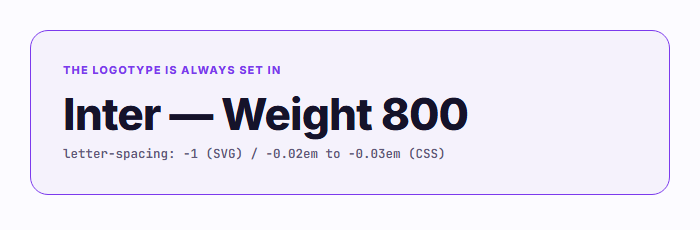
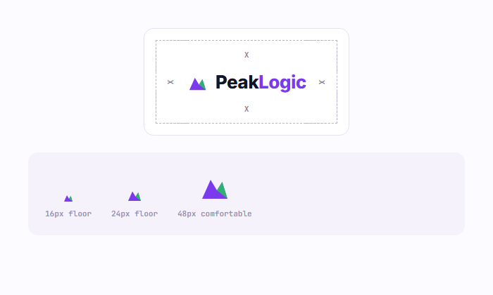
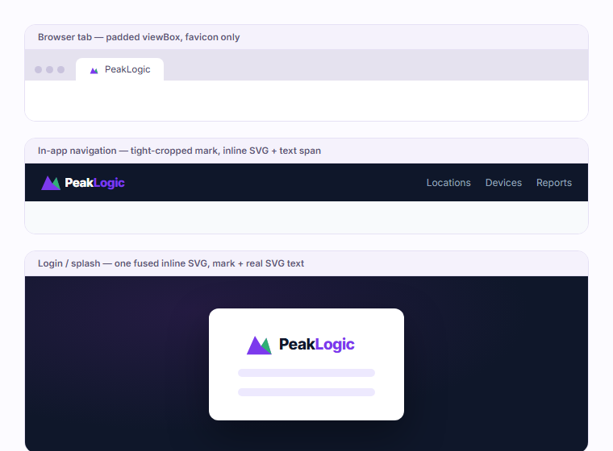

# PeakLogic Brand Guidelines

**Version 1.0 — authoritative source of truth**

This document is the single, canonical specification for PeakLogic's visual identity — the mark, the logotype, the color palette, typography, and usage rules. It governs every surface the brand appears on: product UI, marketing, documentation, and partner-facing material. Where any other copy of the mark, any color value, or any typographic treatment conflicts with what's written here, this document wins.

This file is maintained at `marketing/brand/BRAND_GUIDELINES.md` in every PeakLogic repository and referenced from each repository's `CLAUDE.md`. It is not a local or per-project convention — it is the one specification every repository implements.

---

## 1. The Mark

The PeakLogic mark is a two-facet triangle: a solid purple peak with one green highlight facet layered over its upper-right face.

```svg
<svg xmlns="http://www.w3.org/2000/svg" viewBox="0 0 32 32" fill="none">
  <path d="M4 28 L12 10 L18 20 L23 12 L28 28 Z" fill="#7C3AED"/>
  <path d="M18 20 L23 12 L28 28 Z" fill="#22C55E" opacity="0.85"/>
</svg>
```

**Construction rules**

- The two facets are never recolored independently, and the green facet is always layered at exactly 85% opacity.
- The mark is always scaled uniformly. Never stretch it non-uniformly to fit a layout.
- Two viewBox variants are both correct, used in different contexts:
  - **Padded (`0 0 32 32`)** — the standalone mark, used for favicons and app icons.
  - **Tight-cropped (`4 10 24 18`, or the geometrically identical re-originned `0 0 24 18`)** — used for every inline mark+wordmark lockup in product UI, because it's what makes the sizing rule in §8 land cleanly on a text baseline.

## 2. The Logotype

The mark paired with the wordmark, set in Inter 800.

```svg
<svg xmlns="http://www.w3.org/2000/svg" viewBox="0 0 230 48" fill="none">
  <g transform="translate(0,6)">
    <path d="M0,36 L16,0 L28,20 L38,4 L48,36 Z" fill="#7C3AED"/>
    <path d="M28,20 L38,4 L48,36 Z" fill="#22C55E" opacity="0.85"/>
  </g>
  <text x="62" y="33" font-family="Inter, 'Segoe UI', sans-serif" font-weight="800" font-size="30" letter-spacing="-1" fill="#0F172A">Peak<tspan fill="#7C3AED">Logic</tspan></text>
</svg>
```

On a dark background, swap the "Peak" fill to `#FFFFFF`. The mark colors never change between light and dark.

**Canonical files** — these three files are the only standalone logo assets that should exist. Every other surface should reference them (directly, or via one shared component built from them) rather than re-authoring the path data:

| File | Use |
|---|---|
| `marketing/brand/peaklogic-mark.svg` | Mark only |
| `marketing/brand/peaklogic-logotype.svg` | Full logotype, light backgrounds |
| `marketing/brand/peaklogic-logotype-dark.svg` | Full logotype, dark backgrounds |

## 3. The Logotype Typeface

Called out on its own, not folded into a general typography note, because the typeface is as much a fixed part of the wordmark as its color.



The logotype's typeface is **Inter, weight 800** — never a lighter or heavier weight, never a different family — with tight negative tracking (`letter-spacing: -1` in SVG units; `-0.02em` to `-0.03em` in CSS).

Load the full weight range, every time:

```html
<link rel="preconnect" href="https://fonts.googleapis.com">
<link rel="preconnect" href="https://fonts.gstatic.com" crossorigin>
<link href="https://fonts.googleapis.com/css2?family=Inter:wght@400;500;600;700;800&display=swap" rel="stylesheet">
```

Note the range ends at `800`. Loading only up to `700` and then applying `font-weight: 800` in CSS doesn't error — it silently substitutes the nearest loaded weight or a synthetic bold, and the wordmark renders subtly wrong in a way that's easy to miss in code review.

**Never substitute.** The wordmark is never set in any of these, or any other fallback — Inter only: `system-ui`, `Segoe UI`, `Arial`, `Helvetica Neue`, `Roboto`. A surface that genuinely cannot load Google Fonts (offline-first, strict CSP) should fall back to the system sans-serif stack deliberately and visibly documented as a fallback — never silently.

## 4. Clear Space & Minimum Size

Clear space is measured in **X** — the mark's own height. Nothing else (text, UI chrome, a container edge) may enter that margin on any side.



**Minimum size**: below the digital floor (16px), the green facet starts to disappear into anti-aliasing and the two colors read as one blob — stop shrinking before that happens. 24px is the practical floor for any in-app placement; 48px is comfortable for a primary lockup.

## 5. Color Palette

### Core — the brand

| | Name | Hex | Usage |
|---|---|---|---|
| 🟣 | **Purple** | `#7C3AED` | Primary brand color. "Logic" in the wordmark, links, primary actions, focus states. |
| 🟢 | **Green** | `#22C55E` | The mark's highlight facet only, always at 85% opacity. |
| ⬛ | **Ink** | `#0F172A` | "Peak" on light backgrounds, body text, dark surfaces. |

### Extended — UI support

| | Name | Hex | Usage |
|---|---|---|---|
| | Purple-mid | `#8B5CF6` | UI accents, hover states, gradient stops. **Never the wordmark.** |
| | Purple-soft | `#EDE9FE` | Tint backgrounds, badges. |
| | Green-soft | `#DCFCE7` | Success-state tint backgrounds. |

The extended shades exist for interface work — a hover state, a tinted badge, a gradient stop. The logo itself (the mark and the wordmark) never uses them: it is always exactly the three core colors above.

### The one rule that never bends

> **"Logic" is always exactly `#7C3AED`.** Not `#8B5CF6`, not any other shade, on any background, under any condition. There is no light/dark exception for the wordmark — only "Peak" flips between ink and white.

## 6. Logo in Context

Three real placements, at the spacing and viewBox crop each one actually calls for:



## 7. Logo Usage

**Do**

- Render "Logic" as exactly `#7C3AED`, every time, on every background.
- Load Inter weight 800 explicitly wherever the wordmark renders.
- Size the mark at `1.2em` height relative to the wordmark's own font-size (§8).
- Use the tight-cropped viewBox for in-app lockups, the padded viewBox for standalone assets.
- Scale the mark and logotype uniformly — the same factor on both axes.
- Use a single fused inline SVG (mark + real SVG text) for login and splash screens.
- Reference the canonical asset files, or a shared component built from them.

**Don't**

- Substitute `#8B5CF6` or any other shade for "Logic," for any reason.
- Introduce a light/dark-conditional color rule for the wordmark.
- Pair the mark and wordmark at independently-chosen fixed-pixel sizes.
- Stretch the mark non-uniformly to fit a layout.
- Recolor the green facet, or change its opacity away from 0.85.
- Use an `` icon plus a text span for a full-size login or splash lockup.
- Ship a product surface with no favicon reference at all.

## 8. Implementation Specification

**Mark-to-wordmark sizing** — the mark's rendered height is always `1.2×` the wordmark's font-size, implemented with em-relative units so the ratio holds at every screen size:

```css
.brand-icon { width: 1.6em; height: 1.2em; }
.brand-word { font-size: 1em; /* the icon's 1.2em is relative to this */ }
```

**Full lockup (login / splash)** — one fused inline SVG, mark and wordmark both as real SVG elements, per §2.

**In-app chrome (nav, sidebar, footer)** — an inline `<svg>` mark paired with an HTML text span for the wordmark is the accepted standard pattern. This is not the same as an ``-icon-plus-span composition, which is reserved for the smallest, most compact placements only (e.g. a toolbar favicon-style icon), never a primary lockup.

## 9. Favicon

The padded mark, no background shape:

```html
<link rel="icon" href="/favicon.svg" type="image/svg+xml">
```

Every product surface — every portal, every marketing property — ships this reference. There is no acceptable surface with no favicon at all.

## 10. White-Label Distinction

PeakLogic's channel partners render their own branding inside the product — a monogram, a color pair, a wordmark of their own. That is a separate, deliberate white-label system and is not governed by this document. The one place the two can meet is a "Powered by PeakLogic" attribution line placed beside a partner's own mark — that small attribution is PeakLogic's own brand, and is subject to every rule above.

---

*PeakLogic Brand Guidelines, v1.0. Maintained at `marketing/brand/BRAND_GUIDELINES.md` across every PeakLogic repository. This document supersedes all prior or local copies of the mark, palette, or typography spec, wherever found.*
